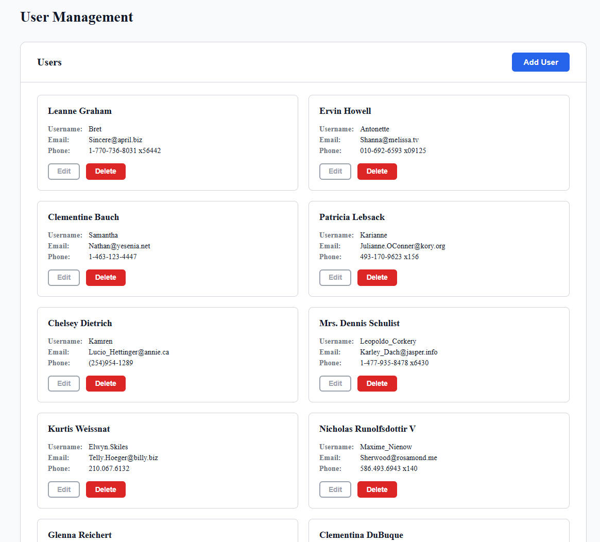
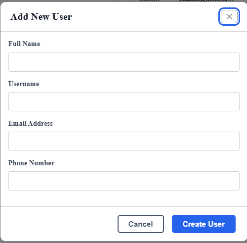
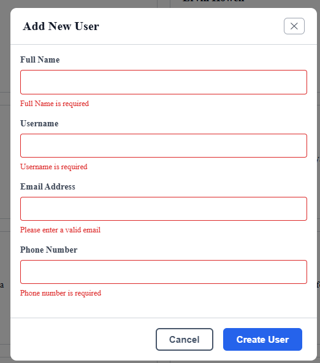
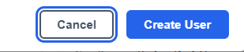
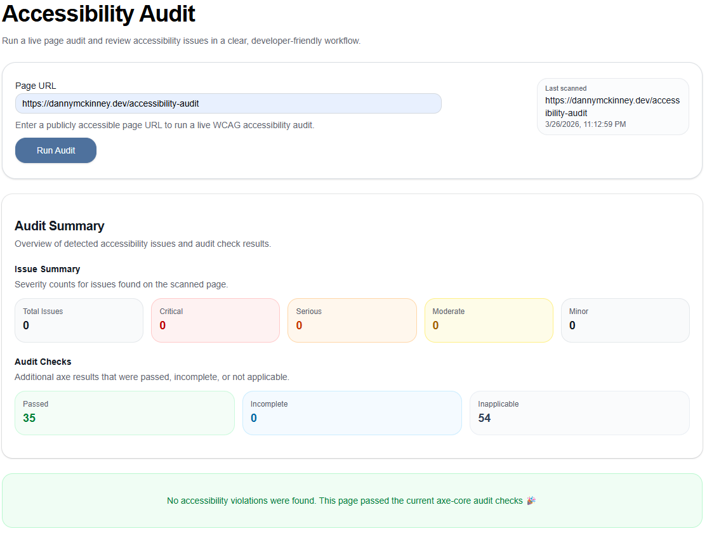
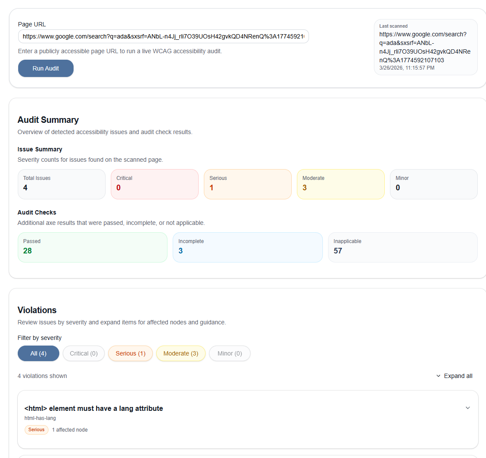

## Accessible Form Handling in React (Production Patterns)

Most form validation UX is still broken — especially for accessibility.

Common issues:

- Errors are not associated with inputs
- Screen readers don’t announce validation changes
- Focus gets lost in modals
- Keyboard users get trapped or disoriented

This project demonstrates how to build accessible form validation and modal workflows in React + TypeScript using real WCAG 2.1 patterns.

These are not theoretical patterns — they reflect production experience fixing 900+ accessibility issues across enterprise applications.

Live Demo: https://react-ts-form-validation.vercel.app/

Audit Tool: https://www.dannymckinney.dev/accessibility-audit

---

## Screenshots

### Main View — Structured Layout



### Modal Form — Accessible Dialog Pattern



### Validation Errors — Clear, Announced Feedback



### Focus Management — Keyboard Navigation



### Audit Results — Verified Accessibility


---

## What Most Developers Get Wrong

- Using visual-only error messages without screen reader support
- Not linking errors to inputs via aria-describedby
- Not managing focus when modals open/close
- Relying only on color to indicate errors
- Letting validation run without clear timing (confusing UX)

This project addresses each of these directly.

---

## Key Accessibility Patterns

### Accessible Form Validation

- Controlled inputs with `aria-invalid` and `aria-describedby` wired to error messages
- `role="alert"` on error spans for immediate screen reader announcement
- `noValidate` with custom validation logic — full control over UX and error timing
- Email regex and phone format validation with clear, actionable error messages

### Modal Accessibility (WCAG 2.1 SC 2.1.2, 2.4.3)

Modals are one of the most common sources of accessibility issues. This implementation ensures users never lose focus or context.

- `role="dialog"` and `aria-modal="true"` for correct screen reader behavior
- `aria-labelledby` linking the dialog to its visible heading
- **Focus trap** — Tab and Shift+Tab cycle only through modal elements while open
- Focus moves into modal on open, returns to trigger button on close
- Escape key closes modal and returns focus — keyboard users never get stranded

### Screen Reader Support

- `role="status"` + `aria-live="polite"` success announcement after user creation
- `sr-only` utility class keeps announcement region in DOM without visual noise
- Loading and error states use appropriate live region roles
- All icon-only buttons have descriptive `aria-label` attributes
- Disabled Edit buttons include both `disabled` and `aria-disabled="true"`

### Semantic HTML

- `<article>` with `aria-labelledby` for each user card
- `<dl>`, `<dt>`, `<dd>` for structured user data — not just divs
- `<main>` landmark with `aria-labelledby` pointing to the page heading
- `<ul>` for the user list with proper list semantics

### Keyboard Navigation

- All interactive elements reachable and operable via keyboard
- `focus-visible` CSS — focus rings show for keyboard users, hidden for mouse
- Tab order follows visual layout

---

## Tech Stack

- React 18
- TypeScript
- Vite
- Vanilla CSS (no framework — intentional, to show CSS fundamentals)

---

## Project Structure

```
src/
  components/
    Modal.tsx        # Reusable accessible modal with focus trap
    FormField.tsx    # Reusable labeled input with error handling
    UserList.tsx     # User grid with empty state
    UserCard.tsx     # Individual user card with actions
    UserForm.tsx     # Controlled form with validation
  hooks/
    useFetchUsers.ts # Data fetching with loading/error states
  types/
    users.ts         # User, FormErrors interfaces
  App.tsx
  main.tsx
  index.css
```

---

## Accessibility Testing

Tested with:

- **axe DevTools** — 0 violations (WCAG 2.1 AA)
- **Lighthouse** — 100 accessibility score
- **NVDA screen reader** — full keyboard and announcement testing
- **Keyboard-only navigation** — all flows completable without a mouse

> **Note:** Automated tools only catch a subset of accessibility issues. Manual testing (screen reader + keyboard navigation) was performed to validate real-world usability and interaction flows.

### Tested with my own Accessibility Audit Tool



For context, even large production sites can surface accessibility issues in automated audits:


---

## Getting Started

```bash
# Install dependencies
npm install

# Start dev server
npm run dev

# Build for production
npm run build
```

---

## Background

This project was built as part of a reskilling effort into modern React and TypeScript after 5 years in enterprise fintech UI development.

The accessibility patterns reflect real production experience, including serving as a WCAG SME and leading remediation of 900+ accessibility issues across 30+ pages.

The goal was not just to build a form — but to demonstrate how accessible patterns should actually be implemented in real applications.

The goal was to build something that demonstrates not just that I can write React, but that I understand _why_ the patterns matter.
